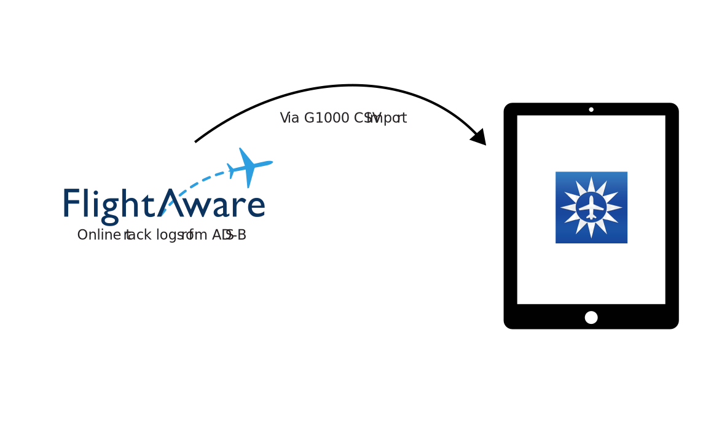

# KML to G1000 CSV Converter
    

## About The Project

This python script can convert either [FlightAware](https://www.flightaware.com/) KML files **or KML exports from Foreflight** to the Garmin G1000 CSV format so that other instances of Foreflight can import it. 

After moving the track log from one iPad to another, rather than sourcing from FlightAware.   

I worked on this when I forgot my iPad during a flight. Other than the lack of a nice EFB (electronic flight bag), I didn't have a track log to go with my logbook entry. While there's nothing wrong with this, it bothered me. My CFI's iPad had logged the flight, so I asked him to send it the track log to me.
In my search for converters, I found the original project [FlightAware to Foreflight](https://github.com/dscpsyl/FlightawareToForeflight)  

Even though I have a FlightAware Pro account, the track log was significantly decimated. I wanted the highest density of track points as possible.

The decimated output from FlightAware vs the online display:

The output online looks pretty good. 

**But when you export it, the data is significantly decimated.**

**Much Better:**
 

So:
I forked the repo and added the following features:  
- Ability to read Foreflight-flavor KML files
- Install script and requiements.txt for easy installation
- Backwards compatibility with Python 3.8
- Tab-complete compatibility for the CLI interactions
- Command line arguments, if preferred

## Exporting from Foreflight and Foreflight Web
To export either a decimated or full-resolution KML file from Foreflight, follow the below sequence:

## Exporting from FlightAware Website
To export a decimated KML from FlightAware, select the specific flight you're interested in, then press the somewhat poorly-marked export button. See highlight below:  
  

## NOTE
**Of note: ForeFlight will error if you try to import a trackline with a duplicate name. The error will be obtuse and not very helpful. You can import duplicate logs, but they must have different names.**

## Getting Started

This tool requires Python 3.8 or later. I chose to run this in an Ubuntu VM, but it should work on any standard Python install.

Ideally, you should run this with a pip venv for better package version management, but that's beyond the scope of this tutorial. 

### Prerequisites

- Clone the repo with `git clone https://github.com/alorman/foreflight-track-import.git` or download it manually [from releases](https://github.com/alorman?tab=packages&repo_name=foreflight-track-import)

- Change your directory to the repo directory with `cd foreflight-track-import`

- Run the installer to download the required dependencies with `python3 install.py`

- The installer will download the following
-- [BeautifulSoup4](https://pypi.org/project/beautifulsoup4/) 4.12.3 or higher
-- [DateTime](https://pypi.org/project/DateTime/) 5.5 or higher
-- [glob2](https://pypi.org/project/glob2/) 0.7 or higher
-- [lmxl](https://pypi.org/project/lxml/) 5.3.0 or higher
-- [pandas](https://pypi.org/project/pandas/) 2.2.3 or higher
-- [requests](https://pypi.org/project/requests/) 2.22.0 or higher
-- [requests-unixsocket](https://pypi.org/project/requests-unixsocket/) 0.2.0 or higher

## Usage

This tool can be used either from the command line with command line arguments or interactively. **The feature to grab flights interactively from FlightAware is not implemented as a command line argument.**

### Command Line Usage

The help file can be summoned with `main.py -h`.  

The following commands can be used from the CLI without interaction:  
Inputs:  
`--input-kml` -- specify a single KML (either Foreflight or FlightAware type) for conversion.  

`--input-kml-dir` -- specify an input directory of KML files. This will act on all KML files in the directory.  

`--input-url` -- specify a FlightAware URL for a specific flight, this will then automatically download the KML file and convert it

Outputs:  
`--output-csv` -- specify the output name of a single CSV, when a single KML is specified. **If not specified, it will use the same directory and name as specified by the `--input-kml` argument.** If a file with an identical name already exist in output, it will skip conversion.  

`--output-csv-dir` -- specify the output director for multiple CSV files. If the directory does not exist, it will be created. The names of the input KML files will be used verbatim to name the CSV files. **If not specified, it will use the same directory and name as specified by the `--input-kml-dir` argument**. If file with identical names already exist in the output directory, it will skip conversion.

Examples:
To convert a specific KML within the `examples` directory to a specific CSV output in a different folder:  
`main.py --input-kml examples/tracklog-from-foreflight.kml --output-csv examples/output/converted-foreflight-track.csv`  

To convert all the KML files within the `examples` folder and convert them in-place to CSV files:
`main.py --input-kml-dir examples/`  

To convert all the KML files within the `examples` directory and write them to a different folder:  
`main.py --input-kml-dir examples/ --output-csv-dir examples/output`

### Interactive Use

If you prefer interactive use with prompts:
`python3 main.py` to launch the script.  

Option `1`:  
- Convert all the KML files (either Foreflight or FlightAware) in the specified directory to CSVs
-- All the files will be converted
-- The output directory is the same as the input directory
-- The names of the KML files are transferred verbatim to the CSV files
-- All paths are **relative to the script directory** so you may need to add `../` preceding your directory. Tab-complete is supported in this feature
-- The default directory is the the script directory for both input and output

Option `2` **BROKEN**:  
- Find and download a specific flight from [FlightAware](https://www.flightaware.com/)
-- This option is broken for reasons I haven't had a chance to look into. I think FlightAware may have changed their API access  

Option `3`:  
- Supply a direct browser link to the FlightAware track log for that specfic flight. 
-- The link should end with `/tracklog` like `https://www.flightaware.com/live/flight/N15190/history/20241031/1441Z/KGON/KGON/tracklog`
-- The application will then download the KML file for this flight
-- While FlightAware is very good, this data can be significantly decimated compared to live logging. It is also reliant on ADS-B data receivers being within range of the flight being tracked. No reception = No track data.

## Contributing

Contributions are what make the open source community such an amazing place to learn, inspire, and create. Any contributions you make are **greatly appreciated**.

If you have a suggestion that would make this better, please fork the repo and create a pull request. You can also simply open an issue with the tag "enhancement".

## License

Distributed under the MIT License. See `LICENSE.txt` for more information.

## Contact
Alex Lorman - [www.alexlorman.com](www.alexlorman.com)

Credit for the basis of this application to:

SimYouLater - [@SimYouLater28](https://twitter.com/SimYouLater28)

Original Project - [https://github.com/dscpsyl/FlightawareToForeflight](https://github.com/dscpsyl/FlightawareToForeflight)

